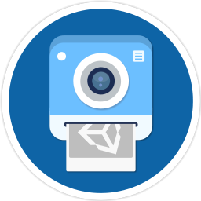

<h1 align="center">Capture-2-Device</h1>

  

  
  
  

It is simple plugin for TA process in unity.  
If you want to see how your `game scene` feels inside the `real device`, You have to capture game scene and transfer it to the your device.  
This plug-in automates this process with a one button.

## To Do
- [ ] : Auto update backup path in `.gitignore`
- [ ] : Add setup guide

## How to Use

> 1. Select the folder where you want to save the screenshot. (Add `folder path` to `.gitignore` file)
> 1. Click right button, Find and Click `OrcaAssist > Set C2D Backup Path`
> 1. Setup 'Slack Bot' or `Telegram Bot` and get api token. (See here for more information)
> 1. Write more setting infomation (ex. channel name, chat_id etc... )
> 1. Now, you can use `OrcaAssist > Capture 2 Device > to Slack`, `to Telegram` or `to Discord` function

## How to Get Token
### Slack
***UPDATE SOON***

### Telegram
***UPDATE SOON***

### Discord
> Really easy to acquire tokens for webhook. Check [Here](https://support.discordapp.com/hc/en-us/articles/228383668-Intro-to-Webhooks)

## License

The class is licensed under the [MIT License](http://opensource.org/licenses/MIT):

Copyright &copy; 2017 [Sang Hyeon Kim](http://www.github.com/rlatkdgus500).

Permission is hereby granted, free of charge, to any person obtaining a copy of this software and associated documentation files (the "Software"), to deal in the Software without restriction, including without limitation the rights to use, copy, modify, merge, publish, distribute, sublicense, and/or sell copies of the Software, and to permit persons to whom the Software is furnished to do so, subject to the following conditions:

The above copyright notice and this permission notice shall be included in all copies or substantial portions of the Software.
